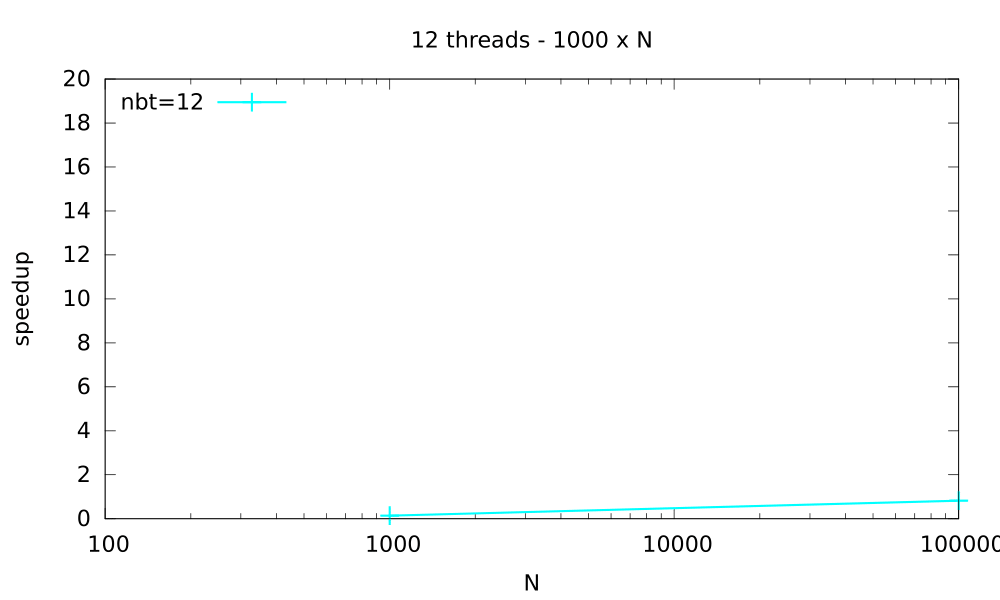

# Experiments with OpenMP

This repository houses multiple implementations of various algorithms in OpenMP.

- [Experiments with OpenMP](#experiments-with-openmp)
  - [Overview](#overview)
  - [Results](#results)
    - [Reduce v1](#reduce-v1)
    - [Reduce v2](#reduce-v2)
    - [Numerical Integration](#numerical-integration)
    - [Prefix Sum](#prefix-sum)
    - [Merge Sort](#merge-sort)
    - [Bubble Sort](#bubble-sort)
    - [Longest Common Subsequence](#longest-common-subsequence)

## Overview

This repository contains multiple subfolders -

- `reduce_v1` - a program that computes the sum of an array in parallel using the OpenMP for loop construct
- `reduce_v2` - a program that computes the sum of an array in parallel using the OpenMP tasking constructs
- `numint` - a program that computes the numerical integration of an array in parallel using OpenMP
- `prefixsm` - a program that computes the prefix sum of an array in parallel using OpenMP
- `mergesort` - a program that sorts an array in parallel using the merge sort technique via OpenMP
- `lcs` - an OpenMP program that computes the longest common subsequence of an array in parallel
- `bubblesort` a parallel version of bubble sort using OpenMP

## Results

### Reduce v1

### Reduce v2

### Numerical Integration

### Prefix Sum

### Merge Sort

### Bubble Sort

### Longest Common Subsequence

